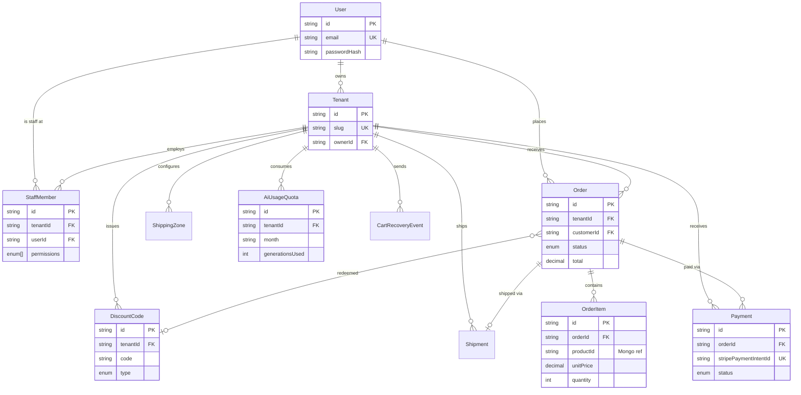

# Phase 0 — Module 1: Database Schema Design

**Status:** Complete
**Deliverables:** `backend/prisma/schema.prisma`, `backend/prisma/manual-sql/001_enable_rls.sql` (moved out of `prisma/migrations/` during Phase 1 Module 1 — Prisma's migrate engine treats every subfolder there as a real migration and errors on anything else), `backend/src/models/*.model.ts`, `backend/src/models/plugins/tenantScope.plugin.ts`
**Built with:** `database-schema-designer` skill (relational side) + `mongodb-schema-design` skill (document side), per Implementation_Plan.md Section 0 checklist.

This satisfies Phase 0's exit criteria: "Prisma schema + Mongoose schemas committed." It does not scaffold a runnable backend yet — no `package.json`/build tooling exists under `backend/` yet, since that belongs to Phase 1 (Foundation). This module's job was the schema design itself.

---

## 1. Assumptions made (flagging per "Clarify First")

A few decisions weren't fully pinned down in Implementation_Plan.md and were resolved as follows — flag if any should change before Phase 1 starts building against these schemas:

1. **Money fields** use `Decimal(10,2)` in Postgres and `Decimal128` in Mongo — never floats, to avoid rounding errors in totals/quotas.
2. **IDs**: Postgres uses `cuid()` (sortable, non-sequential, matches the reference pattern from `database-schema-designer`); MongoDB uses default `ObjectId`.
3. **One review per customer per product** is enforced via a unique index — not stated explicitly in the scope doc, but a reasonable real-world constraint for a reviews feature.
4. **AiUsageQuota limits** (`generationsLimit`, `chatMessagesLimit`) are stored per-row rather than hardcoded, so a future "quota tiers" feature wouldn't require a schema change — this is the one place a little future-flexibility was added, since it costs nothing now and the alternative (hardcoded limits) would require a migration later for a one-line business change.
5. **Cart data itself is not modeled here** — carts live in Redis per Implementation_Plan.md Phase 2, not in either database. Only the post-checkout `Order` is persisted.

---

## 2. Relational schema (PostgreSQL / Prisma)

### Entity-relationship diagram



### Why this shape

- **`User` is shared between merchants and customers.** A customer never gets a `Tenant` or `StaffMember` row — ownership and staff access are additive facts about a `User`, not a separate account type. This avoids duplicating auth logic for two "kinds" of accounts that are otherwise identical (email + password).
- **`OrderItem.productId` is a plain string, not a Postgres FK** — the product it references lives in MongoDB. `productTitleSnapshot` and `unitPrice` are copied onto the line item at order time so a later catalog edit (or deletion) never rewrites history.
- **Every tenant-scoped table indexes `tenantId`**, and the highest-traffic lookup (`Order` by store + status, for the merchant order list) gets a composite index — see Section 8 (Constraints) and Section 6 (Scope) of the scope document for why isolation is treated as a hard requirement, not a nice-to-have.
- **Two-layer isolation**: Prisma middleware (Phase 1, application layer) plus the RLS policies in `001_enable_rls.sql` (database layer). If the app-layer middleware has a bug, RLS is the backstop — this is exactly the tenant-isolation testing target called out in Implementation_Plan.md Phase 6.

---

## 3. Document schema (MongoDB / Mongoose)

### Collections and their relationships

```
Product ──────< ProductReview        (reference — unbounded, paginated independently)
Product ──1:1── AiGeneratedContent   (reference — separate collection for module-ownership reasons, see model file comment)
ChatTranscript (standalone, tenant-scoped, TTL-expired)
```

### Embed vs. reference decisions (applying the decision framework)

| Relationship | Cardinality | Decision | Why |
|---|---|---|---|
| Product → images | 1:few, bounded (≤10) | **Embed** | Always read with the product; small, fixed-size. |
| Product → reviews | 1:many, unbounded | **Reference** | A popular product can have thousands of reviews; paginated independently of the product page; embedding risks the 16MB document limit. |
| Product ↔ AiGeneratedContent | 1:1 | **Reference** (exception to the usual 1:1-embed rule) | Different write owners (catalog module vs. AI content module, built by different students per Section 12) and a distinct write path (the AI orchestrator never touches core catalog fields). |
| AiGeneratedContent → history | 1:few, bounded (≤5) | **Embed, capped** | Cheap "compare with last generation" UX, not a compliance audit trail — doesn't need the full document-versioning pattern (separate revisions collection). |
| ChatTranscript → messages | 1:few in practice, capped at 200 | **Embed, capped + TTL** | A transcript is always read as a whole conversation; capping plus a TTL index keeps documents small without a second collection. |

### Tenant isolation

Every tenant-scoped collection (`Product`, `ProductReview`, `AiGeneratedContent`, `ChatTranscript`) carries its own `storeId` field directly — not just reachable through a parent reference — and applies the shared `tenantScopePlugin`, which refuses to execute a find/update/delete that omits `storeId` from its filter. This mirrors the Prisma middleware on the relational side, per Implementation_Plan.md Section 1.

### Indexes

- `Product`: text index on `{title, description}` (catalog search, Phase 3), compound `{storeId, category}` (browsing/filtering), `{storeId}` alone.
- `ProductReview`: compound `{storeId, productId, createdAt: -1}` (paginated reviews newest-first), unique `{productId, customerId}` (one review per customer per product).
- `AiGeneratedContent`: `{storeId}`, unique `{productId}` (enforces the 1:1 relationship at the DB level).
- `ChatTranscript`: unique `{storeId, conversationId}`, `{storeId, customerId}`, and a TTL index on `expiresAt`.

---

## 4. What's deliberately deferred

- **`$jsonSchema` validators at the MongoDB driver level** — Mongoose's own schema validation (types, `required`, `min`/`max`, `enum`) already covers correctness for this project's scope. A database-level `$jsonSchema` guard is a defense-in-depth option the `mongodb-schema-design` skill recommends for production hardening, but adding it now, before any application code exists to violate it, would be validating against a hypothetical rather than a real gap — revisit if Phase 6 testing surfaces a real need.
- **Running `scripts/erd_generator.py` / `scripts/schema_validator.py`** from the `database-schema-designer` skill — Python isn't installed on this machine, so the ERD above was written by hand instead. If Python gets installed later, both scripts can be pointed at a generated `schema.sql` (`prisma migrate diff --from-empty --to-schema-datamodel prisma/schema.prisma --script`) to double-check normalization and regenerate the diagram automatically.
